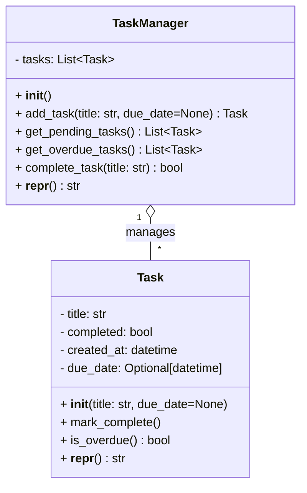

# Task Manager Module 🗂️

Welcome to the **Task Manager** module! This simple yet powerful utility allows you to create, manage, and track tasks entirely in memory. Whether you need to jot down a quick reminder or track deadlines with due dates, this module has you covered.

---

## 📚 Index

1. [Overview](#1-overview)
2. [Data Models](#2-data-models)  
   2.1. [Task](#21-task)  
   2.2. [TaskManager](#22-taskmanager)  
3. [Usage Example](#3-usage-example)
4. [API Reference](#4-api-reference)  
   4.1. [Task Methods](#41-task-methods)  
   4.2. [TaskManager Methods](#42-taskmanager-methods)  
5. [Class Diagram](#5-class-diagram)
6. [Notes & Best Practices](#6-notes--best-practices)

---

## 1. Overview

The **Task Manager** module consists of two main classes:

- **Task** 🏷️: Represents an individual to-do item, with optional due date and completion status.
- **TaskManager** 🤖: Maintains a collection of `Task` instances, providing methods to add, query, and complete tasks.

All data is stored in memory (a simple Python `list`), making this ideal for lightweight scripts, prototypes, or educational purposes.

---

## 2. Data Models

### 2.1 Task

The `Task` class encapsulates the details of a single to-do item.

```python
from datetime import datetime
from typing import Optional

class Task:
    def __init__(self, title: str, due_date: Optional[datetime] = None):
        self.title: str           = title
        self.completed: bool      = False
        self.created_at: datetime = datetime.now()
        self.due_date: Optional[datetime] = due_date

    def mark_complete(self) -> None:
        """✔️  Mark this task as completed."""
        self.completed = True

    def is_overdue(self) -> bool:
        """
        ⏰  Check if the task is past its due date.
        Returns False if no due_date is set.
        """
        if self.due_date:
            return datetime.now() > self.due_date
        return False

    def __repr__(self) -> str:
        return f"<Task title={self.title!r} completed={self.completed}>"
```

**Attributes**

| Name        | Type                    | Description                                 |
|-------------|-------------------------|---------------------------------------------|
| `title`     | `str`                   | The descriptive title of the task.          |
| `completed` | `bool`                  | `True` if task is done, else `False`.       |
| `created_at`| `datetime`              | Timestamp when the task was created.        |
| `due_date`  | `Optional[datetime]`    | Optional deadline for the task.             |

**Key Methods**

| Method                | Returns            | Description                                                |
|-----------------------|--------------------|------------------------------------------------------------|
| `mark_complete()`     | `None`             | Mark the task as finished.                                 |
| `is_overdue()`        | `bool`             | Check if current time has passed the `due_date`.           |
| `__repr__()`          | `str`              | Human-readable representation, useful for debugging/logs.  |

---

### 2.2 TaskManager

The `TaskManager` class holds and manipulates multiple `Task` instances.

```python
from typing import List, Optional
from datetime import datetime

class TaskManager:
    def __init__(self):
        self.tasks: List[Task] = []

    def add_task(self, title: str, due_date: Optional[datetime] = None) -> Task:
        """
        ➕  Create a new Task and add it to the manager.
        Returns the created Task.
        """
        task = Task(title, due_date)
        self.tasks.append(task)
        return task

    def get_pending_tasks(self) -> List[Task]:
        """📋  Retrieve all tasks not yet completed."""
        return [task for task in self.tasks if not task.completed]

    def get_overdue_tasks(self) -> List[Task]:
        """⚠️  Retrieve all pending tasks whose due date has passed."""
        return [task for task in self.tasks if task.is_overdue() and not task.completed]

    def complete_task(self, title: str) -> bool:
        """
        ✅  Mark the first matching pending task as completed.
        Returns True if successful, False if no matching pending task found.
        """
        for task in self.tasks:
            if task.title == title and not task.completed:
                task.mark_complete()
                return True
        return False

    def __repr__(self) -> str:
        return f"<TaskManager tasks={len(self.tasks)}>"
```

**Attributes**

| Name     | Type            | Description                      |
|----------|-----------------|----------------------------------|
| `tasks`  | `List[Task]`    | Internal list of managed tasks.  |

**Key Methods**

| Method                              | Returns          | Description                                                                 |
|-------------------------------------|------------------|-----------------------------------------------------------------------------|
| `add_task(title, due_date=None)`    | `Task`           | Create & append a new task.                                                 |
| `get_pending_tasks()`               | `List[Task]`     | List of tasks not yet marked complete.                                      |
| `get_overdue_tasks()`               | `List[Task]`     | List of pending tasks whose deadlines have passed.                          |
| `complete_task(title)`              | `bool`           | Marks the first matching pending task complete; returns operation success.  |
| `__repr__()`                        | `str`            | Provides a summary of how many tasks are in the manager.                   |

---

## 3. Usage Example

```python
from task_manager import TaskManager
from datetime import datetime, timedelta

# Initialize the manager
tm = TaskManager()

# Add tasks (one with and one without a due date)
tm.add_task("Write documentation", datetime.now() + timedelta(days=1))
tm.add_task("Pay electricity bill")

# Show pending tasks
print("Pending:", tm.get_pending_tasks())

# Complete a task
if tm.complete_task("Pay electricity bill"):
    print("✔️ 'Pay electricity bill' marked complete!")

# Simulate checking for overdue
overdue = tm.get_overdue_tasks()
print("Overdue:", overdue or "None! Great job staying on track.")
```

---

## 4. API Reference

### 4.1 Task Methods

| Method            | Signature                       | Description                                 |
|-------------------|---------------------------------|---------------------------------------------|
| `__init__`        | `(title: str, due_date=None)`   | Create a task with optional due date.       |
| `mark_complete`   | `() -> None`                    | Mark the task as done.                      |
| `is_overdue`      | `() -> bool`                    | Check if now > due_date.                    |
| `__repr__`        | `() -> str`                     | Debug-friendly string.                      |

### 4.2 TaskManager Methods

| Method                  | Signature                                      | Description                                                      |
|-------------------------|------------------------------------------------|------------------------------------------------------------------|
| `__init__`              | `() -> None`                                   | Initialize empty task list.                                      |
| `add_task`              | `(title: str, due_date=None) -> Task`          | Create and store a new task.                                     |
| `get_pending_tasks`     | `() -> List[Task]`                             | Return tasks not yet completed.                                  |
| `get_overdue_tasks`     | `() -> List[Task]`                             | Return tasks with due_date < now and not completed.              |
| `complete_task`         | `(title: str) -> bool`                         | Mark first matching pending task as complete; `True` if found.   |
| `__repr__`              | `() -> str`                                    | String summarizing total tasks.                                  |

---

## 5. Class Diagram

Below is a **Class Diagram** showing how these classes relate:



---

## 6. Notes & Best Practices

- 🔄 **Persistence**: This implementation keeps data only in memory. For real-world use, integrate a database or file storage.  
- 🔒 **Thread Safety**: Not safe for concurrent access. Add locking if you plan to share across threads.  
- 🆕 **Extensions**: Consider adding task prioritization, tagging, or categorization.  
- 🛠️ **Error Handling**: Currently, lookup is by exact title match. You may wish to expose tasks by ID or raise exceptions on missing tasks.

---

Happy task-managing! 🚀 EMIroffene